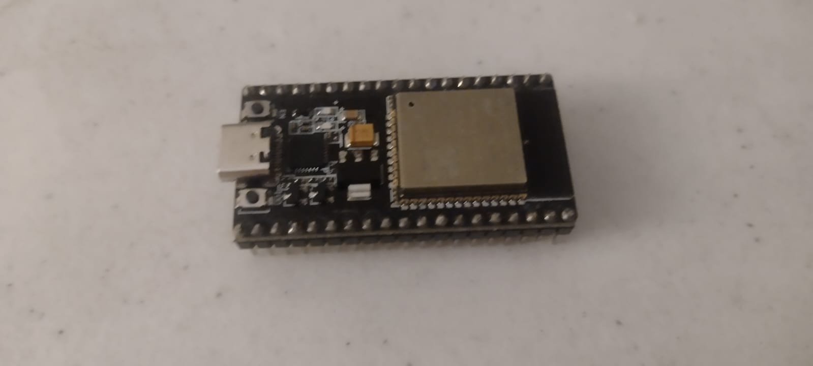
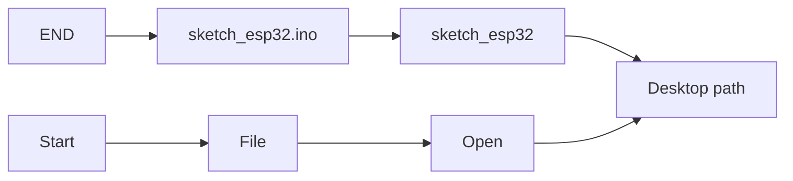

# `ESPTRAIL`


An `ESP32` project written in C++ with integrated `MeetSpace IoT API` & `Spotify Web API`


# What can I do with it?

- Message between IoT devices
- Smart messaging (Discord, Whatsapp)

  Save the image/message to send into the data queue untill 24hr


# How to setup

## 1.- Clone the repository in your desktop

```
cd path/to/your/Desktop
git clone https://github.com/code1O/esptrail.git
```

## 2.- Open `ARDUINO IDE`




## 3.- Upload

Upload the script in the `ARDUINO IDE`